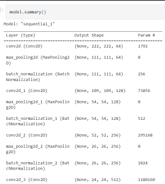

# NutriChive : Food Ingredient, Recipe, and Nutrition Archive

An application that utilize machine learning, especially in the field of computer vision, to create an application that can recognize food ingredients and recommend food recipes that can be obtained from them so that food ingredients can be utilized properly.

## Setup
### Environtment

This experiment was executed on the Kaggle platform, leveraging the GPU P100 accelerator. The implementation was carried out using the Python programming language, with the TensorFlow framework serving as the primary computational tool. This choice of infrastructure and technology stack ensures a robust and scalable environment for conducting sophisticated machine learning tasks.

### Dataset
The dataset utilized for training the model is the Fruit and Vegetable Image Recognition dataset (Kritik Seth, 2020). The dataset consists of 36 classes contains 3 folders:
- Training Set (100 images each class)
- Validation Set (10 images each class)
- Testing Set (10 images each class)

The image in the dataset is resized to a size of 224 x 224 pixels. In addition, to prevent overfitting, augmentation is also carried out on the training set in the form of random brightness, random rotation, random contrast, random rotate, and also random zoom until finally 6140 training set data is obtained.

Source :

Kritik Seth, "Fruits and Vegetables Image Recognition Dataset," Kaggle 2020 [https://www.kaggle.com/kritikseth/fruit-and-vegetable-image-recognition]

## Model
### Architecture
The model we used was created from scratch. We used Convolutional Neural Network in creating it. After the convolution process we do downsampling by using max pooling operation and followed by batchnormalization. The activation function we use is ReLU. The model we created consists of 5 levels of convolution process with the number of filters/kernels applying multiples of 2 at each level. In addition, at the end of the model there is a Global Max Pooling operation and also a dense layer with 36 units according to the number of classes in the dataset we use.

### Training Result
In our training process, we use a smart approach to optimize our model effectively. We employ a loss function called Sparse Categorical Cross Entropy, tailored for classification tasks. The Adam optimizer, known for its adaptive learning rate, fine-tunes the model's parameters efficiently.

To enhance learning, we've implemented a practical callback called ReduceLearningRateOnPlateau. If the validation loss doesn't improve for 10 consecutive epochs, we adjust the learning rate. Originally set at 0.0001, we multiply it by 0.1 to encourage better convergence. Throughout this training regimen, we apply 50 epochs to ensure a comprehensive learning experience for our model. 

This thoughtful combination of a suitable loss function, adaptive optimizer, dynamic learning rate adjustment, and a sufficient number of epochs ensures our model is trained effectively and performs optimally.

The model achieved a training accuracy of 96.77% and a corresponding validation accuracy of 96.87%.

Presented below is a graphical representation illustrating the historical progression of accuracy and loss metrics during the training phase, encompassing both the training set and validation set data.

Accuracy History Graph :

Loss History Graph : 

## Example of Prediction Results After Being Deployed to the Application

